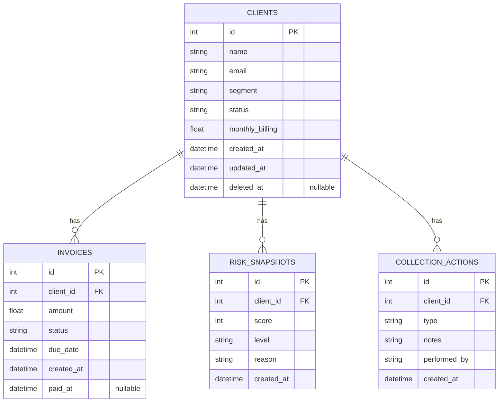

# Entity Relationship Diagram - Northwind Database

## Tablas Detalladas

### 1. CLIENTS

**Propósito**: Almacenar información de clientes de Northwind

| Campo | Tipo | Constraints | Descripción |
|-------|------|-------------|-------------|
| id | INTEGER | PK, AUTO_INCREMENT | ID único |
| name | VARCHAR(200) | NOT NULL | Nombre del cliente |
| email | VARCHAR(150) | NOT NULL | Email de contacto |
| segment | VARCHAR(50) | NOT NULL | Segmento: enterprise, startup, standard, zombie |
| status | VARCHAR(50) | NOT NULL | Estado: active, at_risk, delinquent, suspended |
| monthly_billing | DECIMAL(10,2) | NOT NULL | Billing mensual en USD |
| created_at | TIMESTAMP | NOT NULL, DEFAULT NOW() | Fecha de creación |
| updated_at | TIMESTAMP | NOT NULL, DEFAULT NOW() | Fecha de última actualización |
| deleted_at | TIMESTAMP | NULL | Soft delete |

**Relaciones**:
- 1:N con INVOICES
- 1:N con RISK_SNAPSHOTS
- 1:N con COLLECTION_ACTIONS

---

### 2. INVOICES

**Propósito**: Rastrear facturas y pagos de clientes

| Campo | Tipo | Constraints | Descripción |
|-------|------|-------------|-------------|
| id | INTEGER | PK, AUTO_INCREMENT | ID único |
| client_id | INTEGER | FK → CLIENTS.id, NOT NULL | Cliente propietario |
| amount | DECIMAL(10,2) | NOT NULL | Monto en USD |
| status | VARCHAR(50) | NOT NULL | Estado: paid, pending, overdue |
| due_date | TIMESTAMP | NOT NULL | Fecha de vencimiento |
| created_at | TIMESTAMP | NOT NULL, DEFAULT NOW() | Fecha de creación |
| paid_at | TIMESTAMP | NULL | Fecha de pago |

**Relaciones**:
- N:1 con CLIENTS

---

### 3. RISK_SNAPSHOTS

**Propósito**: Histórico de evaluaciones de riesgo por cliente

| Campo | Tipo | Constraints | Descripción |
|-------|------|-------------|-------------|
| id | INTEGER | PK, AUTO_INCREMENT | ID único |
| client_id | INTEGER | FK → CLIENTS.id, NOT NULL | Cliente evaluado |
| score | INTEGER | NOT NULL, CHECK (0-100) | Score de riesgo 0-100 |
| level | VARCHAR(50) | NOT NULL | Nivel: low, medium, high |
| reason | TEXT | NOT NULL | Explicación del score |
| created_at | TIMESTAMP | NOT NULL, DEFAULT NOW() | Fecha de cálculo |

**Relaciones**:
- N:1 con CLIENTS

---

### 4. COLLECTION_ACTIONS

**Propósito**: Auditoría de acciones de cobranza realizadas

| Campo | Tipo | Constraints | Descripción |
|-------|------|-------------|-------------|
| id | INTEGER | PK, AUTO_INCREMENT | ID único |
| client_id | INTEGER | FK → CLIENTS.id, NOT NULL | Cliente en cuestión |
| type | VARCHAR(50) | NOT NULL | Tipo: call, email, note |
| notes | TEXT | NOT NULL | Detalles de la acción |
| performed_by | VARCHAR(100) | NOT NULL | Quién realizó la acción |
| created_at | TIMESTAMP | NOT NULL, DEFAULT NOW() | Cuándo se realizó |

**Relaciones**:
- N:1 con CLIENTS

---

## Relaciones y Cardinalidad

### CLIENTS → INVOICES (1:N)
- Un cliente puede tener 0 a N facturas
- Cada factura pertenece a exactamente 1 cliente
- ON DELETE: Cascade (si se borra cliente, borrar facturas)

### CLIENTS → RISK_SNAPSHOTS (1:N)
- Un cliente puede tener 0 a N evaluaciones de riesgo
- Cada snapshot pertenece a exactamente 1 cliente
- Historial de cómo cambió el riesgo en el tiempo
- ON DELETE: Cascade

### CLIENTS → COLLECTION_ACTIONS (1:N)
- Un cliente puede tener 0 a N acciones de cobranza
- Cada acción pertenece a exactamente 1 cliente
- Auditoría completa de cobranzas
- ON DELETE: Cascade

---
